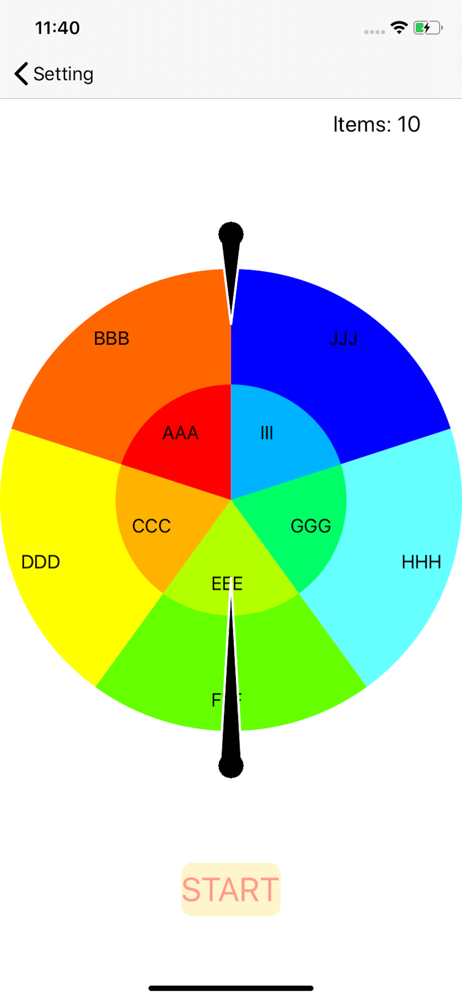
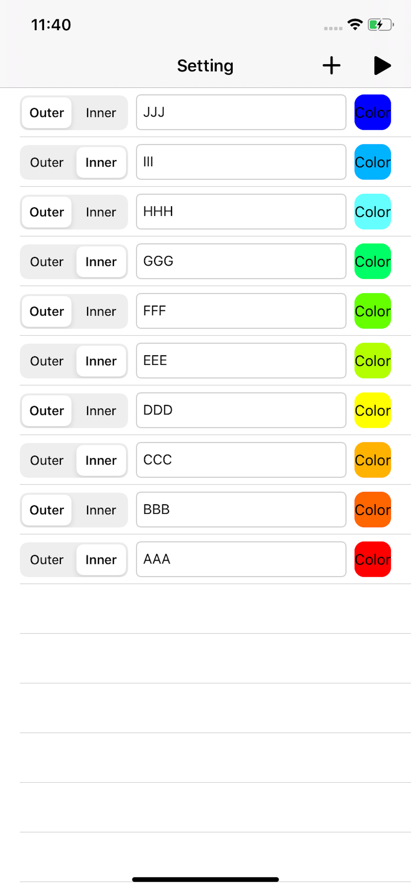

# DoubleRoulette
【シンプルなルーレット】
あれ？でも今までなかった？

### 一度に二つ、決めれます！

## 使い方
* 画面右上の+ボタンで、ルーレットの要素を追加
* ルーレット要素の情報(Outer/Inner、要素名、色)を、タップまたはキーボード入力にて変更
* 画面右上の三角形のボタンをタップし、ルーレット画面へ遷移
* STARTボタンをタップして、ルーレット開始！！

Outer/Innerによってルーレット要素を外側のルーレットに追加するか、または内側のルーレットに追加するか選択可能です。
シンプルですが使い道は様々だと思います。
(私は飲み会にて、Outerを罰ゲーム名、Innerを人の名前にして遊んでいます…笑笑)

 

【App Store】リリースしました！
(URL: https://apps.apple.com/jp/app/%E3%83%80%E3%83%96%E3%83%AB%E3%83%AB%E3%83%BC%E3%83%AC%E3%83%83%E3%83%88/id1476267611)
